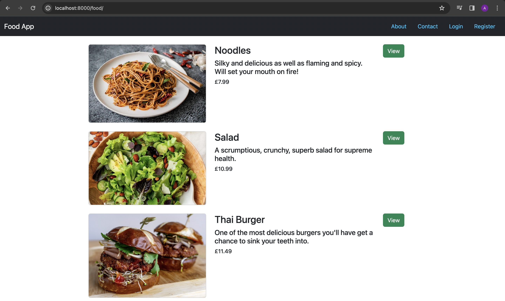

## Why am I learning Django?

After successfully completing my last major solo project, I am now embarking on my next journey: mastering Django to prepare myself for the professional software development world. During my Django learning journey, I will also focus on refining other essential skills, including the use of JavaScript and Bootstrap as necessary. While I plan to follow tutorials on Udemy for initial guidance, I am committed to not just replicating the tutorial projects. At every opportunity, I will enhance the functionality of the applications shown in the tutorials, adding my own features whenever I deem it necessary. This approach will undoubtedly push me out of my comfort zone, compelling me to venture on my own and solve problems independently—a critical capability for thriving in the professional sphere.

## This Project

This is a food web app using Python with Django, Bootstrap, and a tiny bit of JavaScript. My aim is to make this look and function like a real world web app that someone would use to manage a restaurant/takeaway or order food on.

    

    

